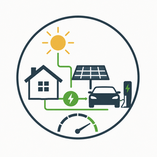

<p align="center">
  
</p>

# Charging Power Calculator

[](https://github.com/hacs/integration)

Home Assistant custom integration that calculates optimal EV charging power from solar surplus, with automatic 1/3-phase switching and hysteresis-based start/stop logic.

## Features

- Calculates available solar surplus power in real-time
- Outputs a charging setpoint in watts and amperes
- Automatic 1-phase ↔ 3-phase switching with hysteresis
- Time-based start/stop debouncing to prevent charger toggling
- **SoC-based battery reserve curve** — variable reserve power based on house battery charge level
- **Visual Lovelace curve editor** — drag breakpoints on a chart to tune the curve
- Number entity sliders on the device page for quick adjustments
- Runs entirely locally (no cloud dependency)

## Installation

### HACS (Recommended)

1. Open HACS in your Home Assistant instance
2. Click the three dots in the top right → **Custom repositories**
3. Add `https://github.com/AnSc1172/charging-power-calculator` with category **Integration**
4. Search for "Charging Power Calculator" and install it
5. Restart Home Assistant
6. Add the integration via **Settings → Devices & Services → Add Integration**

### Manual

1. Copy the `custom_components/charging_power_calculator` folder to your Home Assistant `config/custom_components/` directory
2. Restart Home Assistant
3. Add the integration via **Settings → Devices & Services → Add Integration**

## Configuration

The integration is configured through the UI. You need to provide:

| Parameter | Description |
|-----------|-------------|
| Grid Power Sensor | Sensor measuring grid power (positive = import, negative = export) |
| EV Charging Power Sensor | Sensor measuring current EV charging consumption |
| House Battery Power Sensor | Sensor measuring house battery charge power |
| House Battery SoC Sensor | *(optional)* Battery state of charge (0–100%). Enables the characteristic curve |
| Charging Active | Binary sensor or input_boolean indicating if the EV charger is active |
| Max Battery Power | Fallback reserve power when SoC sensor is unavailable (default: 2500 W) |
| Min EV Power | Minimum EV charging power / start threshold (default: 1400 W) |
| Fine Adjust | Manual offset to bias the setpoint (default: 500 W) |

All parameters can be reconfigured at any time via **Settings → Devices & Services → Configure**.

## Entities

The integration creates the following entities:

### Sensors
| Entity | Unit | Description |
|--------|------|-------------|
| Surplus Power Available | W | Total available solar surplus |
| Setpoint EV Charging Power | W | Recommended charging power |
| Setpoint Ampere | A | Recommended current per phase |
| Battery Reserve Power | W | Current interpolated reserve (from curve or static fallback) |

### Binary Sensors
| Entity | Description |
|--------|-------------|
| Setpoint Charging On | Whether the charger should be ON |
| Is 1 Phase Charging | Whether to use single-phase charging |

### Number Controls (on device page)
| Entity | Range | Description |
|--------|-------|-------------|
| Reserve at 20% SoC | 0–5000 W | Battery reserve when SoC is low |
| Reserve at 50% SoC | 0–5000 W | Battery reserve at mid-charge |
| Reserve at 80% SoC | 0–5000 W | Battery reserve when nearly full |

## Battery Reserve Curve

When a **House Battery SoC Sensor** is configured, the static reserve power is replaced by a characteristic curve. The curve maps battery SoC (%) to reserve power (W) with linear interpolation between breakpoints.

**Default curve** (used when no custom curve is saved):

| SoC | Reserve Power |
|-----|---------------|
| 0% | 3000 W |
| 20% | 2500 W |
| 60% | 2000 W |
| 80% | 500 W |
| 100% | 500 W |

This prioritizes house battery charging when the battery is low and gives most surplus to EV charging when the battery is nearly full.

### Editing the curve

**From the device page:** Adjust the slider controls (Reserve at 20%/50%/80%) for quick tuning.

**From a dashboard (full visual editor):** Add the "Battery Reserve Curve" card to any dashboard:

```yaml
type: custom:battery-reserve-curve-card
entity: sensor.charging_power_calculator_battery_reserve_power
soc_entity: sensor.your_house_battery_soc
max_watts: 5000
```

The card is auto-registered — no manual resource setup needed. Drag breakpoints to reshape the curve, add/remove points, and click **Save** to persist.

### Service

You can also set the curve programmatically via the service:

```yaml
service: charging_power_calculator.set_battery_reserve_curve
data:
  entry_id: "your_config_entry_id"
  curve:
    - [0, 3000]
    - [20, 2500]
    - [60, 2000]
    - [80, 500]
    - [100, 500]
```

The `entry_id` is available as an attribute on the Battery Reserve Power sensor.

## How It Works

The algorithm runs every 31 seconds and:

1. **Calculates surplus**: `surplus = −grid_power + battery_power + ev_power`
2. **Resolves battery reserve**: Interpolates the curve at current SoC (or uses static fallback)
3. **Determines setpoint**: `setpoint = surplus − battery_reserve + fine_adjust`
4. **Applies hysteresis**: Waits 60s before starting or stopping to avoid toggling
5. **Selects phase**: Switches to 3-phase above 3500 W, back to 1-phase below 3000 W
6. **Calculates ampere**: Converts watts to amps, clamped between 6–16 A

For a detailed explanation with pseudocode, see [DOCUMENTATION.md](DOCUMENTATION.md).

## License

MIT License — see [LICENSE](LICENSE).
